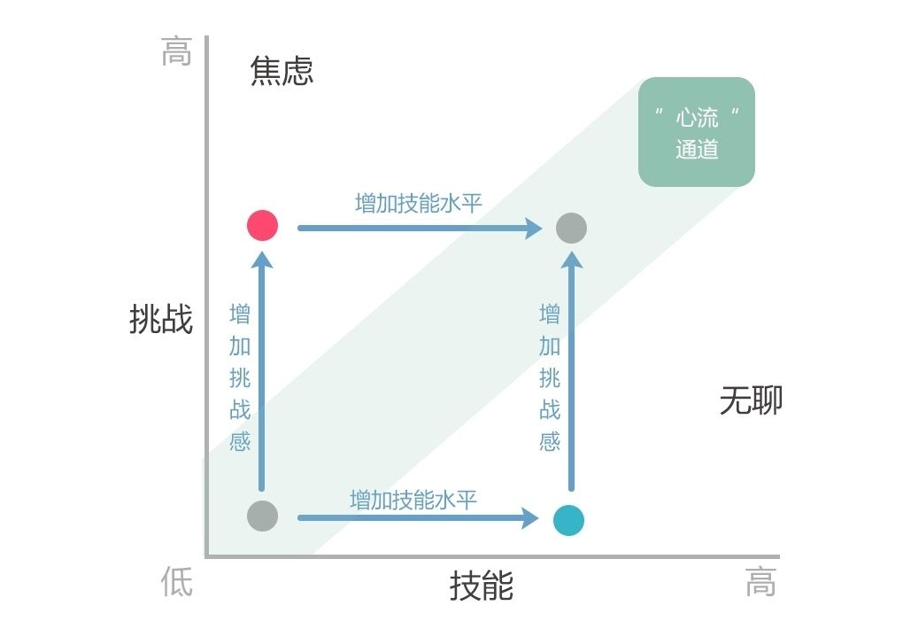

# §0 刷题内功心法

> 建议在心流范围内摇摆！！！

**推荐先完成 2000 分以下的题目，难题可以留到后面再做。** 

# §1 滑动窗口与双指针

* [§1.1 定长滑动窗口](#§1.1 定长滑动窗口)
* [§1.2 不定长滑动窗口](#§1.2 不定长滑动窗口)
* [§1.3 单序列双指针](#§1.3 单序列双指针)
* [§1.4 双序列双指针](#§1.4 双序列双指针)
* [§1.5 三指针](#§1.5 三指针)
* [§1.6 关联题单](#§1.6 关联题单)

## §1.1 定长滑动窗口

[【套路】教你解决定长滑窗！适用于所有定长滑窗题目！](https://leetcode.cn/problems/maximum-number-of-vowels-in-a-substring-of-given-length/solutions/2809359/tao-lu-jiao-ni-jie-jue-ding-chang-hua-ch-fzfo/)

### §1.1.1 基础

- [x] [1456\. 定长子串中元音的最大数目](https://leetcode.cn/problems/maximum-number-of-vowels-in-a-substring-of-given-length/)  1263
- [x] [643\. 子数组最大平均数 I](https://leetcode.cn/problems/maximum-average-subarray-i/)
- [x] [1343\. 大小为 K 且平均值大于等于阈值的子数组数目](https://leetcode.cn/problems/number-of-sub-arrays-of-size-k-and-average-greater-than-or-equal-to-threshold/)  1317
- [x] [2090\. 半径为 k 的子数组平均值](https://leetcode.cn/problems/k-radius-subarray-averages/)  1358
- [x] [2379\. 得到 K 个黑块的最少涂色次数](https://leetcode.cn/problems/minimum-recolors-to-get-k-consecutive-black-blocks/)  1360
- [x] [1652\. 拆炸弹](https://leetcode.cn/problems/defuse-the-bomb/)  1417
- [x] [1052\. 爱生气的书店老板](https://leetcode.cn/problems/grumpy-bookstore-owner/)  1418
- [x] [2841\. 几乎唯一子数组的最大和](https://leetcode.cn/problems/maximum-sum-of-almost-unique-subarray/)  1546
- [x] [2461\. 长度为 K 子数组中的最大和](https://leetcode.cn/problems/maximum-sum-of-distinct-subarrays-with-length-k/)  1553
- [x] [1423\. 可获得的最大点数](https://leetcode.cn/problems/maximum-points-you-can-obtain-from-cards/)  1574
- [x] [1297\. 子串的最大出现次数](https://leetcode.cn/problems/maximum-number-of-occurrences-of-a-substring/)  1748
- [x] [2653\. 滑动子数组的美丽值](https://leetcode.cn/problems/sliding-subarray-beauty/)  1786
- [ ] [1176\. 健身计划评估](https://leetcode.cn/problems/diet-plan-performance/)  （会员题）
- [ ] [1100\. 长度为 K 的无重复字符子串](https://leetcode.cn/problems/find-k-length-substrings-with-no-repeated-characters/)  （会员题）
- [ ] [1852\. 每个子数组的数字种类数](https://leetcode.cn/problems/distinct-numbers-in-each-subarray/)  （会员题）
- [ ] [1151\. 最少交换次数来组合所有的 1](https://leetcode.cn/problems/minimum-swaps-to-group-all-1s-together/)  （会员题）
- [ ] [2107\. 分享 K 个糖果后独特口味的数量](https://leetcode.cn/problems/number-of-unique-flavors-after-sharing-k-candies/)  （会员题）

### §1.1.2 进阶（选做）

- [ ] [2134\. 最少交换次数来组合所有的 1 II](https://leetcode.cn/problems/minimum-swaps-to-group-all-1s-together-ii/)  1748
- [ ] [1888\. 使二进制字符串字符交替的最少反转次数](https://leetcode.cn/problems/minimum-number-of-flips-to-make-the-binary-string-alternating/)  2006
- [ ] [567\. 字符串的排列](https://leetcode.cn/problems/permutation-in-string/)
- [ ] [438\. 找到字符串中所有字母异位词](https://leetcode.cn/problems/find-all-anagrams-in-a-string/)
- [ ] [30\. 串联所有单词的子串](https://leetcode.cn/problems/substring-with-concatenation-of-all-words/)
- [ ] [2156\. 查找给定哈希值的子串](https://leetcode.cn/problems/find-substring-with-given-hash-value/)  2063
- [ ] [2953\. 统计完全子字符串](https://leetcode.cn/problems/count-complete-substrings/)  2449
- [ ] [683\. K 个关闭的灯泡](https://leetcode.cn/problems/k-empty-slots/)  （会员题）做到 $O(n)$
- [ ] [2067\. 等计数子串的数量](https://leetcode.cn/problems/number-of-equal-count-substrings/)  （会员题）
- [ ] [2524\. 子数组的最大频率分数](https://leetcode.cn/problems/maximum-frequency-score-of-a-subarray/)  （会员题）

### §1.1.3 其他（选做）

- [ ] [2269\. 找到一个数字的 K 美丽值](https://leetcode.cn/problems/find-the-k-beauty-of-a-number/)  1280
- [ ] [1984\. 学生分数的最小差值](https://leetcode.cn/problems/minimum-difference-between-highest-and-lowest-of-k-scores/)  1306
- [ ] [220\. 存在重复元素 III](https://leetcode.cn/problems/contains-duplicate-iii/)

## §1.2 不定长滑动窗口

不定长滑动窗口主要分为三类：求最长子数组，求最短子数组，以及求子数组个数。

### §1.2.1 求最长/最大

- [ ] [3\. 无重复字符的最长子串](https://leetcode.cn/problems/longest-substring-without-repeating-characters/)
- [ ] [3090\. 每个字符最多出现两次的最长子字符串](https://leetcode.cn/problems/maximum-length-substring-with-two-occurrences/)  1329
- [ ] [1493\. 删掉一个元素以后全为 1 的最长子数组](https://leetcode.cn/problems/longest-subarray-of-1s-after-deleting-one-element/)  1423
- [ ] [1208\. 尽可能使字符串相等](https://leetcode.cn/problems/get-equal-substrings-within-budget/)  1497
- [ ] [2730\. 找到最长的半重复子字符串](https://leetcode.cn/problems/find-the-longest-semi-repetitive-substring/)  1502
- [ ] [904\. 水果成篮](https://leetcode.cn/problems/fruit-into-baskets/)  1516
- [ ] [1695\. 删除子数组的最大得分](https://leetcode.cn/problems/maximum-erasure-value/)  1529
- [ ] [2958\. 最多 K 个重复元素的最长子数组](https://leetcode.cn/problems/length-of-longest-subarray-with-at-most-k-frequency/)  1535
- [ ] [2779\. 数组的最大美丽值](https://leetcode.cn/problems/maximum-beauty-of-an-array-after-applying-operation/)  1638
- [ ] [2024\. 考试的最大困扰度](https://leetcode.cn/problems/maximize-the-confusion-of-an-exam/)  1643
- [ ] [1004\. 最大连续 1 的个数 III](https://leetcode.cn/problems/max-consecutive-ones-iii/)  1656
- [ ] [1658\. 将 x 减到 0 的最小操作数](https://leetcode.cn/problems/minimum-operations-to-reduce-x-to-zero/)  1817
- [ ] [1838\. 最高频元素的频数](https://leetcode.cn/problems/frequency-of-the-most-frequent-element/)  1876
- [ ] [2516\. 每种字符至少取 K 个](https://leetcode.cn/problems/take-k-of-each-character-from-left-and-right/)  1948
- [ ] [2831\. 找出最长等值子数组](https://leetcode.cn/problems/find-the-longest-equal-subarray/)  1976
- [ ] [2271\. 毯子覆盖的最多白色砖块数](https://leetcode.cn/problems/maximum-white-tiles-covered-by-a-carpet/)  2022
- [ ] [2106\. 摘水果](https://leetcode.cn/problems/maximum-fruits-harvested-after-at-most-k-steps/)  2062
- [ ] [2555\. 两个线段获得的最多奖品](https://leetcode.cn/problems/maximize-win-from-two-segments/)  2081
- [ ] [2009\. 使数组连续的最少操作数](https://leetcode.cn/problems/minimum-number-of-operations-to-make-array-continuous/)  2084
- [ ] [1610\. 可见点的最大数目](https://leetcode.cn/problems/maximum-number-of-visible-points/)  2147
- [ ] [2781\. 最长合法子字符串的长度](https://leetcode.cn/problems/length-of-the-longest-valid-substring/)  2204
- [ ] [2968\. 执行操作使频率分数最大](https://leetcode.cn/problems/apply-operations-to-maximize-frequency-score/)  2444
- [ ] [1040\. 移动石子直到连续 II](https://leetcode.cn/problems/moving-stones-until-consecutive-ii/)  2456
- [ ] [395\. 至少有 K 个重复字符的最长子串](https://leetcode.cn/problems/longest-substring-with-at-least-k-repeating-characters/)
- [ ] [1763\. 最长的美好子字符串](https://leetcode.cn/problems/longest-nice-substring/)  非暴力做法
- [ ] [487\. 最大连续 1 的个数 II](https://leetcode.cn/problems/max-consecutive-ones-ii/)  （会员题）
- [ ] [159\. 至多包含两个不同字符的最长子串](https://leetcode.cn/problems/longest-substring-with-at-most-two-distinct-characters/)  （会员题）
- [ ] [340\. 至多包含 K 个不同字符的最长子串](https://leetcode.cn/problems/longest-substring-with-at-most-k-distinct-characters/)  （会员题）

### §1.2.2 求最短/最小

- [ ] [209\. 长度最小的子数组](https://leetcode.cn/problems/minimum-size-subarray-sum/)
- [ ] [2904\. 最短且字典序最小的美丽子字符串](https://leetcode.cn/problems/shortest-and-lexicographically-smallest-beautiful-string/)  做到 $O(n^2)$
- [ ] [1234\. 替换子串得到平衡字符串](https://leetcode.cn/problems/replace-the-substring-for-balanced-string/)  1878
- [ ] [2875\. 无限数组的最短子数组](https://leetcode.cn/problems/minimum-size-subarray-in-infinite-array/)  1914
- [ ] [1574\. 删除最短的子数组使剩余数组有序](https://leetcode.cn/problems/shortest-subarray-to-be-removed-to-make-array-sorted/)  1932
- [ ] [76\. 最小覆盖子串](https://leetcode.cn/problems/minimum-window-substring/)
- [ ] [632\. 最小区间](https://leetcode.cn/problems/smallest-range-covering-elements-from-k-lists/)
- [ ] [727\. 最小窗口子序列](https://leetcode.cn/problems/minimum-window-subsequence/)  （会员题）联系 76 题

### §1.2.3 求子数组个数

- [ ] [713\. 乘积小于 K 的子数组](https://leetcode.cn/problems/subarray-product-less-than-k/)
- [ ] [1358\. 包含所有三种字符的子字符串数目](https://leetcode.cn/problems/number-of-substrings-containing-all-three-characters/)  1646
- [ ] [2962\. 统计最大元素出现至少 K 次的子数组](https://leetcode.cn/problems/count-subarrays-where-max-element-appears-at-least-k-times/)  1701
- [ ] [3258\. 统计满足 K 约束的子字符串数量 I](https://leetcode.cn/problems/count-substrings-that-satisfy-k-constraint-i/)  做到 $O(n)$
- [ ] [2799\. 统计完全子数组的数目](https://leetcode.cn/problems/count-complete-subarrays-in-an-array/)  做到 $O(n)$
- [ ] [2302\. 统计得分小于 K 的子数组数目](https://leetcode.cn/problems/count-subarrays-with-score-less-than-k/)  1808
- [ ] [2537\. 统计好子数组的数目](https://leetcode.cn/problems/count-the-number-of-good-subarrays/)  1892
- [ ] [2762\. 不间断子数组](https://leetcode.cn/problems/continuous-subarrays/)  1940
- [ ] [3134\. 找出唯一性数组的中位数](https://leetcode.cn/problems/find-the-median-of-the-uniqueness-array/)  2451
- [ ] [3261\. 统计满足 K 约束的子字符串数量 II](https://leetcode.cn/problems/count-substrings-that-satisfy-k-constraint-ii/)  2659
- [ ] [LCP 68. 美观的花束](https://leetcode.cn/problems/1GxJYY/)
- [ ] [2743\. 计算没有重复字符的子字符串数量](https://leetcode.cn/problems/count-substrings-without-repeating-character/)  （会员题）

### §1.2.4 其他（选做）

- [ ] [1438\. 绝对差不超过限制的最长连续子数组](https://leetcode.cn/problems/longest-continuous-subarray-with-absolute-diff-less-than-or-equal-to-limit/)  1672
- [ ] [2401\. 最长优雅子数组](https://leetcode.cn/problems/longest-nice-subarray/)  1750
- [ ] [1156\. 单字符重复子串的最大长度](https://leetcode.cn/problems/swap-for-longest-repeated-character-substring/)  1787 有简单做法
- [ ] [424\. 替换后的最长重复字符](https://leetcode.cn/problems/longest-repeating-character-replacement/)
- [ ] [1918\. 第 K 小的子数组和](https://leetcode.cn/problems/kth-smallest-subarray-sum/)  （会员题）

## §1.3 单序列双指针

### §1.3.1 相向双指针

两个指针 $left=0, right=n−1$，从数组的两端开始，向中间移动。上面的滑动窗口相当于**同向**双指针。

- [ ] [125\. 验证回文串](https://leetcode.cn/problems/valid-palindrome/)
- [ ] [1750\. 删除字符串两端相同字符后的最短长度](https://leetcode.cn/problems/minimum-length-of-string-after-deleting-similar-ends/)  1502
- [ ] [2105\. 给植物浇水 II](https://leetcode.cn/problems/watering-plants-ii/)  1507
- [ ] [977\. 有序数组的平方](https://leetcode.cn/problems/squares-of-a-sorted-array/)  做到 $O(n)$
- [ ] [658\. 找到 K 个最接近的元素](https://leetcode.cn/problems/find-k-closest-elements/)
- [ ] [1471\. 数组中的 K 个最强值](https://leetcode.cn/problems/the-k-strongest-values-in-an-array/)  用双指针解决
- [ ] [167\. 两数之和 II - 输入有序数组](https://leetcode.cn/problems/two-sum-ii-input-array-is-sorted/)
- [ ] [2824\. 统计和小于目标的下标对数目](https://leetcode.cn/problems/count-pairs-whose-sum-is-less-than-target/)
- [ ] [LCP 28. 采购方案](https://leetcode.cn/problems/4xy4Wx/)  同 2824 题
- [ ] [15\. 三数之和](https://leetcode.cn/problems/3sum/)
- [ ] [16\. 最接近的三数之和](https://leetcode.cn/problems/3sum-closest/)
- [ ] [18\. 四数之和](https://leetcode.cn/problems/4sum/)
- [ ] [611\. 有效三角形的个数](https://leetcode.cn/problems/valid-triangle-number/)
- [ ] [1577\. 数的平方等于两数乘积的方法数](https://leetcode.cn/problems/number-of-ways-where-square-of-number-is-equal-to-product-of-two-numbers/)  用双指针实现
- [ ] [923\. 三数之和的多种可能](https://leetcode.cn/problems/3sum-with-multiplicity/)  1711
- [ ] [948\. 令牌放置](https://leetcode.cn/problems/bag-of-tokens/)  1762
- [ ] [11\. 盛最多水的容器](https://leetcode.cn/problems/container-with-most-water/)
- [ ] [42\. 接雨水](https://leetcode.cn/problems/trapping-rain-water/)
- [ ] [1616\. 分割两个字符串得到回文串](https://leetcode.cn/problems/split-two-strings-to-make-palindrome/)  1868
- [ ] [1498\. 满足条件的子序列数目](https://leetcode.cn/problems/number-of-subsequences-that-satisfy-the-given-sum-condition/)  2276
- [ ] [1782\. 统计点对的数目](https://leetcode.cn/problems/count-pairs-of-nodes/)  2457
- [ ] [1099\. 小于 K 的两数之和](https://leetcode.cn/problems/two-sum-less-than-k/)  （会员题）
- [ ] [360\. 有序转化数组](https://leetcode.cn/problems/sort-transformed-array/)  （会员题）
- [ ] [2422\. 使用合并操作将数组转换为回文序列](https://leetcode.cn/problems/merge-operations-to-turn-array-into-a-palindrome/)  （会员题）
- [ ] [259\. 较小的三数之和](https://leetcode.cn/problems/3sum-smaller/)  （会员题）

### §1.3.2 同向双指针

两个指针的移动方向相同（都向右，或者都向左）。

- [ ] [1346\. 检查整数及其两倍数是否存在](https://leetcode.cn/problems/check-if-n-and-its-double-exist/)
- [ ] [532\. 数组中的 k-diff 数对](https://leetcode.cn/problems/k-diff-pairs-in-an-array/)
- [ ] [2122\. 还原原数组](https://leetcode.cn/problems/recover-the-original-array/)  2159

### §1.3.3 背向双指针

两个指针从数组中的同一个位置出发，一个向左，另一个向右，背向移动。

- [ ] [1793\. 好子数组的最大分数](https://leetcode.cn/problems/maximum-score-of-a-good-subarray/)  1946

### §1.3.4 移除子数组

- [ ] [581\. 最短无序连续子数组](https://leetcode.cn/problems/shortest-unsorted-continuous-subarray/)
- [ ] [2972\. 统计移除递增子数组的数目 II](https://leetcode.cn/problems/count-the-number-of-incremovable-subarrays-ii/)  2153
- [ ] [2565\. 最少得分子序列](https://leetcode.cn/problems/subsequence-with-the-minimum-score/)  2432

### §1.3.5 原地修改

- [ ] [27\. 移除元素](https://leetcode.cn/problems/remove-element/)
- [ ] [26\. 删除有序数组中的重复项](https://leetcode.cn/problems/remove-duplicates-from-sorted-array/)
- [ ] [80\. 删除有序数组中的重复项 II](https://leetcode.cn/problems/remove-duplicates-from-sorted-array-ii/)
- [ ] [283\. 移动零](https://leetcode.cn/problems/move-zeroes/)
- [ ] [905\. 按奇偶排序数组](https://leetcode.cn/problems/sort-array-by-parity/)
- [ ] [922\. 按奇偶排序数组 II](https://leetcode.cn/problems/sort-array-by-parity-ii/)
- [ ] [2460\. 对数组执行操作](https://leetcode.cn/problems/apply-operations-to-an-array/)
- [ ] [1089\. 复写零](https://leetcode.cn/problems/duplicate-zeros/)

## §1.4 双序列双指针

### §1.4.1 双指针

- [ ] [2540\. 最小公共值](https://leetcode.cn/problems/minimum-common-value/)  做到 $O(n+m)$
- [ ] [88\. 合并两个有序数组](https://leetcode.cn/problems/merge-sorted-array/)  做到 $O(n+m)$
- [ ] [2570\. 合并两个二维数组 - 求和法](https://leetcode.cn/problems/merge-two-2d-arrays-by-summing-values/)  做到 $O(n+m)$
- [ ] [LCP 18. 早餐组合](https://leetcode.cn/problems/2vYnGI/)
- [ ] [1385\. 两个数组间的距离值](https://leetcode.cn/problems/find-the-distance-value-between-two-arrays/)
- [ ] [1855\. 下标对中的最大距离](https://leetcode.cn/problems/maximum-distance-between-a-pair-of-values/)  1515
- [ ] [925\. 长按键入](https://leetcode.cn/problems/long-pressed-name/)  做到 $O(n+m)$
- [ ] [809\. 情感丰富的文字](https://leetcode.cn/problems/expressive-words/)  1605
- [ ] [2337\. 移动片段得到字符串](https://leetcode.cn/problems/move-pieces-to-obtain-a-string/)  1693
- [ ] [777\. 在 LR 字符串中交换相邻字符](https://leetcode.cn/problems/swap-adjacent-in-lr-string/)  同 2337 题
- [ ] [844\. 比较含退格的字符串](https://leetcode.cn/problems/backspace-string-compare/)  做到 $O(1)$ 额外空间
- [ ] [986\. 区间列表的交集](https://leetcode.cn/problems/interval-list-intersections/)  做到 $O(n+m)$
- [ ] [2070\. 每一个查询的最大美丽值](https://leetcode.cn/problems/most-beautiful-item-for-each-query/)  1724
- [ ] [面试题 16.06. 最小差](https://leetcode.cn/problems/smallest-difference-lcci/)
- [ ] [1537\. 最大得分](https://leetcode.cn/problems/get-the-maximum-score/)  1961
- [ ] [244\. 最短单词距离 II](https://leetcode.cn/problems/shortest-word-distance-ii/)  （会员题）
- [ ] [2838\. 英雄可以获得的最大金币数](https://leetcode.cn/problems/maximum-coins-heroes-can-collect/)  （会员题）
- [ ] [1229\. 安排会议日程](https://leetcode.cn/problems/meeting-scheduler/)  （会员题）
- [ ] [1570\. 两个稀疏向量的点积](https://leetcode.cn/problems/dot-product-of-two-sparse-vectors/)  （会员题）
- [ ] [1868\. 两个行程编码数组的积](https://leetcode.cn/problems/product-of-two-run-length-encoded-arrays/)  （会员题）

### §1.4.2 判断子序列

- [ ] [392\. 判断子序列](https://leetcode.cn/problems/is-subsequence/)
- [ ] [524\. 通过删除字母匹配到字典里最长单词](https://leetcode.cn/problems/longest-word-in-dictionary-through-deleting/)
- [ ] [2486\. 追加字符以获得子序列](https://leetcode.cn/problems/append-characters-to-string-to-make-subsequence/)  1363
- [ ] [2825\. 循环增长使字符串子序列等于另一个字符串](https://leetcode.cn/problems/make-string-a-subsequence-using-cyclic-increments/)  1415
- [ ] [1023\. 驼峰式匹配](https://leetcode.cn/problems/camelcase-matching/)  1537
- [ ] [3132\. 找出与数组相加的整数 II](https://leetcode.cn/problems/find-the-integer-added-to-array-ii/)  1620
- [ ] [522\. 最长特殊序列 II](https://leetcode.cn/problems/longest-uncommon-subsequence-ii/)  ~1700
- [ ] [1898\. 可移除字符的最大数目](https://leetcode.cn/problems/maximum-number-of-removable-characters/)  1913
- [ ] [1055\. 形成字符串的最短路径](https://leetcode.cn/problems/shortest-way-to-form-string/)  （会员题）

## §1.5 三指针

### §1.5.1 滑动窗口

例如，要计算有多少个元素和**恰好等于** $goal$ 的子数组，可以把问题变成：

* 计算有多少个元素和 $≤goal$ 的子数组。
* 计算有多少个元素和 $<goal$ 的子数组。

两者相减，即为答案。

$≤$ 和 $<$ 可以分别跑两次滑动窗口解决。也可以合并到同一个滑动窗口中，维护同一个右端点和两个不同的左端点，即为**三指针**。

- [ ] [930\. 和相同的二元子数组](https://leetcode.cn/problems/binary-subarrays-with-sum/)  1592
- [ ] [1248\. 统计「优美子数组」](https://leetcode.cn/problems/count-number-of-nice-subarrays/)  1624
- [ ] [1712\. 将数组分成三个子数组的方案数](https://leetcode.cn/problems/ways-to-split-array-into-three-subarrays/)  2079
- [ ] [992\. K 个不同整数的子数组](https://leetcode.cn/problems/subarrays-with-k-different-integers/)  2210
- [ ] [1989\. 捉迷藏中可捕获的最大人数](https://leetcode.cn/problems/maximum-number-of-people-that-can-be-caught-in-tag/)  （会员题）

### §1.5.2 非滑动窗口

- [ ] [2367\. 等差三元组的数目](https://leetcode.cn/problems/number-of-arithmetic-triplets/)  做到 $O(n)$
- [ ] [825\. 适龄的朋友](https://leetcode.cn/problems/friends-of-appropriate-ages/)  1697
- [ ] [2563\. 统计公平数对的数目](https://leetcode.cn/problems/count-the-number-of-fair-pairs/)  1721
- [ ] [795\. 区间子数组个数](https://leetcode.cn/problems/number-of-subarrays-with-bounded-maximum/)  1817
- [ ] [2444\. 统计定界子数组的数目](https://leetcode.cn/problems/count-subarrays-with-fixed-bounds/)  2093
- [ ] [1213\. 三个有序数组的交集](https://leetcode.cn/problems/intersection-of-three-sorted-arrays/)  （会员题）

## §1.6 关联题单

* **滑动窗口相关**：[数据结构题单](https://leetcode.cn/circle/discuss/mOr1u6/) 中的「**单调队列**」。
* **双指针相关**：[贪心题单](https://leetcode.cn/circle/discuss/g6KTKL/) 中的「**单序列配对**」和「**双序列配对**」。